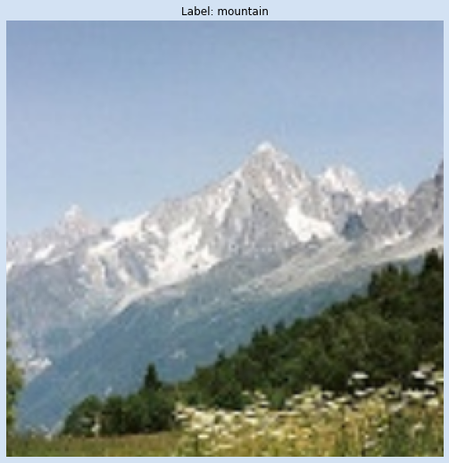

Custom model => https://drive.google.com/file/d/1gGqgDmlkuuHFk5KoSZsheuFLoTbgX7HK/view?usp=sharing

VGG Model => https://drive.google.com/file/d/1Mt519ze77h9PYjRqhu_9ZagTVYQBZjsc/view?usp=sharing

<h1 style="align:center;">🖼️Intel Image Classification</h1>

><h2 style="color:red;">🤔 Problem Statement</h2>

I have got an image classification dataset on [Kaggle](https://www.kaggle.com) (the dataset link is givcen below). There are almost 25k images. Every image size is 150x150. And there are total **6 categories/classes named "buildings", "forest", "glacier", "mountain", "sea" and "street"**. 

Inside the dataset directory, there are 3 sub-directories, one for *training*, one for *testing* and another one for *validation*. I used the *training* and *testing* datasets. For training, there are around 14k images and for testing there are around 3k images. Around 82% data is for testing and 18% data is for training.

When I looked out through the training images, I found that some "mountain" images are covered with ice fow which model will be confused between two classes, "mountain" and "glacier". This will also happen with more two classes, "street" and "buildings". Buildings can be seen in some "street" images. I am attaching some random images from the training dataset with respective labels.

**My problem is to classify the images correctly and also visualize how do the models see the images by *feature maps*.** For this, I have build 2 models. One is my custom model and the other one is the VGG-16.

**My target is to do a `parametric experiment` and to classify the images correctly. The parametric experiment is I will create different models with same Convolution-Pooling blocks architectures but there will be the differences in hidden layers. But total number of  nodes of the hidden layers should be same. Like If I choose constant 100 nodes for hidden layers then I can create a model with 20 layers with 5 nodes for each layer and as well as 25 layers with 4 nodes for each layer. The total number of nodes will be fixed. This parametric test will create `depth vs width` models and then the visualization of the result. Also I have decided to visialize the `feature maps` of the models.**

---

<h2 style="color:red">📅 Dataset</h2>

The dataset which I have used here, you can find in [Kaggle](https://www.kaggle.com/datasets/puneet6060/intel-image-classification).

---

<h2 style="color:red">🔪 My Solution Approach</h2>

<h3 style="color:cyan">Tools and modules</h3>

To solve this problem, I have used these exeternal modules:
- `PyTorch` (GPU version)
- `NumPy`
- `torchvision`
- `torchsummary`
- `Matplotlib`

<h3 style="color:cyan">Import the dataset & Image Transformations</h3>

- There are 6 subdirectories (for each class/category) inside the *training* directory. Same goes to the *testing* directory also. 
- I used `torchvision.dataset.ImageFolder` module (which is suitable for this kind of folder structure) that loads the images and their respective labels.
- After this, I have used `torch.utils.data.DataLoader` to create *train data loader* and *test data loader* which will help to pass the data to the model while training. It also helps to create batches simultaneously.
- I have created batches as well.
- I also did image transformation like `normalization`, `resize` to 150x150 images, `RandomHorizontalFlip` to flip the random selected images horizontally and the finally to `tensor` object.
- For VGG-16 model, I resized images to 224x224 and normalize according to the documentation (mean=[0.485, 0.456, 0.406] and std = [0.229, 0.224, 0.225]).

<h3 style="color:cyan">Parametric Test: Width vs Depth</h3>

- I  wanted to do a small parametric test. I have choosed that there should be fixed numbers of neurons (80) but the number of layers and the number of nodes per hidden layers will be different.
- So, I choosed these combinations of hidden layers:
    - Case 1 - 1 hidden layer with 80 nodes
    - Case 2 - 5 hidden layers with 16 nodes for each layer.
    - Case 3 - 10 hidden layers with 8 nodes for each layer.
    - Case 4 - 20 hidden layers with 4 nodes for each layer.
- After calculating the number of trainable parameters, the output gives the surpurzing results though the number of nodes of hidden layers are same.
    - Case 1 - Total 14,408,962 parameters.
    - Case 2 - Total 2,889,602 parameters.
    - Case 3 - Total 1,449,106 parameters.
    - Case 4 - Total 728,810 parameters.

<h3 style="color:cyan">Build Custom Model & The Faeature Maps</h3>

- While doing the parametric test, I have stored the parameters of each types best model.
- So, after the experiment, I have 4 models. From these I choosed the best one. From the results (results are shown below) I choose the *case 3* model.
- I have saved the model as file.
- Then I took a batch from the test images and passed through the model.
- I have created the architecture of the model is such a way that in prediction time it also returns the feature maps of the first and second convolution layers.
- Then I have plotted that features maps.

<h3 style="color:cyan">Build VGG-16 Model & The Feature Maps</h3>

- I have used the pretrained VGG-16 model. I have downloaded by using the method `torchvision.models.vgg16`.
- Then I have freezed all the layers that prevent to update the model's weights and bias.
- But I have replaced the output layer to change the number of nodes (that's 6 for my case). And trained the model for 10 epochs.
- This gives better result than my custom models. 
- Then I also have extracted the feature maps from the first convolution layer of the model and have plotted.
---

<h2 style="color:red">📝 Results I Got</h2>

<h3 style="color:cyan">From My Parametric Test: Width vs Depth</h3>

I have ran the parametric experiment (The objective of the test and models description is specified above). The result of the parametric test is given below.

<h3 style="color:cyan">My Custom Model's Feature Maps</h3>

The feature maps of the first convolution layer. I had decided channel output as 12. So the first row is the sample images. If we took a column from the feature maps, then first image is the original image and the next 12 below images are feature maps of that original image.

The feature maps of the second convolution layer. For this case also, if we took one column from the below result, the first image is the original image and the next 64 below images are the feature maps of that original image.

<h3 style="color:cyan">From The VGG-16 Model</h3>

The original image of which I have extracted the feature maps.

And the feature maps are

---

If you like my work please me a star to this repository. My email rsayan553@gmail.com.
